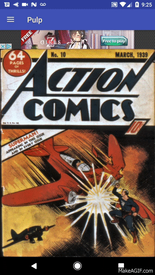
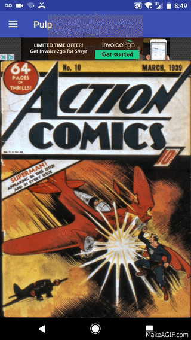

# Pulp
Pulp is a comic book reader for android. It can read CBZ and CBR comic files. I created Pulp because I wanted reading digital comic books to feel the same way as reading real ones. I definately learned a lot about dealing with compressed archives and bitmaps in this project.

# UI
                                                                
                                To create the feeling
                                of handleing a real comic
                                I decided to make the cover
                                of the comics a swipable
                                object. To achieve this
                                I used [Swipe-Deck](https://github.com/aaronbond/Swipe-Deck)

                               
                                Swiping the Comic left goes
                                to the next one in the stack 
                                but swiping right opens the comic 
                                up so you can read it.
                                
# Firebase and Collections                                

                                The user can make there own
                                lists of comics. this prevents
                                the user from having to swipe
                                through a large list of comics
                                just to find the one they want 
                                to read. I use firebase to store 
                                these lists for each user. That way 
                                if the user switches devices they
                                can still access there collections.
 
 # Update
 
 I added the ability to turn pages using an app on an android wear watch.
                              
# Thoughts
The hardest part of this project was dealing with RAR archives. When it comes to Java the only thing out there is junrar. Junrar has no documentation so I had to read through the source to piece together how to use it. But once I got it working it did the job.

# Libraries Used
- [Swipe-Deck](https://github.com/aaronbond/Swipe-Deck)
- [Firebase Auth](https://firebase.google.com/docs/auth/)
- [Firebase Database](https://firebase.google.com/docs/database/)
- [Junrar](https://github.com/edmund-wagner/junrar)

